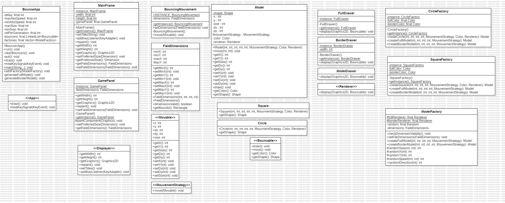

# MCR Laboratoire 1a + b

## 📌 Objectif
Ce laboratoire a pour but de pratiquer l'utilisation de **AWT/Swing** en Java en développant une application graphique interactive.

## 📝 Description
L'application permet :
* D'instancier et d'afficher des cercles 🟡 et des carrés 🟦 dans une fenêtre graphique.
* De déplacer ces objets à l'écran de manière autonome.
* D'initialiser chaque objet aléatoirement :
  * Taille, position initiale, vecteur de déplacement.
* De gérer les collisions avec les bords en les faisant rebondir.
* D'utiliser une architecture modulaire et extensible avec des patterns de conception.

## 🎯 Patterns de conception utilisés
* **Singleton** : Pour garantir une unique instance de GamePanel et MainFrame.
* **Factory** : ShapeFactory permet de créer des formes aléatoires.
* **Strategy** : MovementStrategy définit une interface pour différents comportements de mouvement.
* **MVC (Modèle-Vue-Contrôleur)** : Séparation entre la gestion des formes (shapes), l'affichage (gui) et la logique (main).

## 🔧 Technologies utilisées
- **Java** (JDK 21)
- **AWT/Swing** (JFrame, JPanel, etc.)
- **IntelliJ IDEA** (ou tout autre IDE Java)

## 📂 Structure du projet
```bash
Lab1a/
│── src/
│   ├── main/                     # Point d'entrée de l'application
│   │   ├── BouncerApp.java        # Initialise et gère l'animation des formes
│   │   ├── Main.java              # Point d’entrée principal (optionnel pour des futures tests)
│   │
│   ├── gui/                       # Interface graphique
│   │   ├── Displayer.java         # Interface définissant un affichage graphique
│   │   ├── GamePanel.java         # Panneau où sont affichées les formes (Singleton)
│   │   ├── MainFrame.java         # Fenêtre principale de l'application (Singleton)
│   │
│   ├── movement/                   # Stratégies de mouvement
│   │   ├── BouncingMovement.java   # Mouvement avec rebond sur les bords
│   │   ├── MovementStrategy.java   # Interface pour les stratégies de mouvement
│   │
│   ├── shapes/                     # Gestion des formes et dessin
│   │   ├── Circle.java             # Représente un cercle
│   │   ├── Shape.java              # Classe abstraite des formes
│   │   ├── ShapeDrawer.java        # Classe utilitaire pour dessiner les formes
│   │   ├── ShapeFactory.java       # Génère des formes aléatoires
│   │   ├── Square.java             # Représente un carré
│   │
```

## 📊 Diagramme UML
Le diagramme UML suivant représente l'architecture du projet :



## 🚀 Lancement
### Depuis un IDE (Intellij, Eclipse, NetBeans)
1. Ouvrir le projet dans l'IDE.
2. Exécuter main.BouncerApp.
### Depuis la ligne de commande
1. Compiler le projet :
```bash 
javac -d out -sourcepath src src/main/BouncerApp.java
```

2. Exécuter le programme :
```bash
java -cp out main.BouncerApp
````