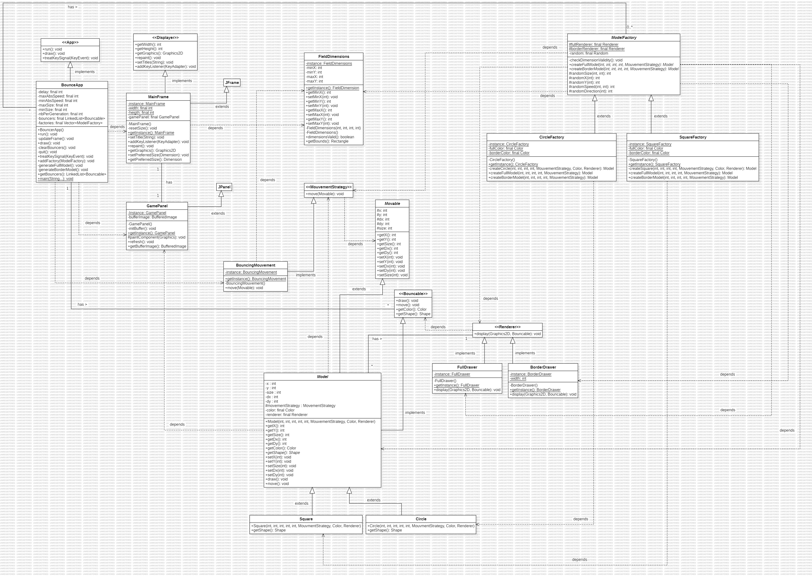

# MCR Laboratoire 1a + b + c

## 📌 Objectif
Ce laboratoire a pour but de pratiquer l'utilisation de **AWT/Swing** en Java en développant une application graphique interactive.

## 📝 Description
L'application permet :
* D'instancier et d'afficher des cercles 🟡 et des carrés 🟦 dans une fenêtre graphique.
* De déplacer ces objets à l'écran de manière autonome.
* D'initialiser chaque objet aléatoirement :
  * Taille, position initiale, vecteur de déplacement.
* De gérer les collisions avec les bords en les faisant rebondir.
* D'utiliser une architecture modulaire et extensible avec des patterns de conception.

## 🎯 Patterns de conception utilisés
* **Singleton** : Pour garantir une unique instance de GamePanel et MainFrame.
* **Factory** : ShapeFactory permet de créer des formes aléatoires.
* **Strategy** : MovementStrategy définit une interface pour différents comportements de mouvement.
* **MVC (Modèle-Vue-Contrôleur)** : Séparation entre la gestion des formes (shapes), l'affichage (gui) et la logique (apps).

## 🔧 Technologies utilisées
- **Java** (JDK 21)
- **AWT/Swing** (JFrame, JPanel, etc.)
- **IntelliJ IDEA** (ou tout autre IDE Java)

## 📂 Structure du projet
```bash
Lab1a/
│── src/
│   ├── apps/                      # Point d'entrée de l'application (ou des applications)
│   │   ├── BouncerApp.java        # Initialise et gère l'animation des formes
│   │   ├── App.java               # Interface pour la création d'applications interagissant avec l'interface graphique
│   │
│   ├── gui/                       # Interface graphique
│   │   ├── Displayer.java         # Interface définissant un affichage graphique
│   │   ├── GamePanel.java         # Panneau où sont affichées les formes (Singleton)
│   │   ├── MainFrame.java         # Fenêtre principale de l'application (Singleton)
│   │
│   ├── movement/                   # Stratégies de mouvement
│   │   ├── BouncingMovement.java   # Mouvement avec rebond sur les bords
│   │   ├── FieldDimensions.java    # Définit les dimensions et limites du champ de mouvement
│   │   ├── MovementStrategy.java   # Interface pour les stratégies de mouvement
│   │   ├── Movable.java            # Class abstraite pour les objets pouvant se déplacer, définissant les méthodes de déplacement
│   │
│   ├── shapes/                     # Gestion des formes et dessin
│   │   ├── drawer/                 # Stratégies d'affichage des formes
│   │   │   ├── BorderDrawer.java   # Gère le dessin des formes avec uniquement un contour
│   │   │   ├── FullDrawer.java     # Gère le dessin des formes pleines (remplies)
│   │   │   ├── ModelDrawer.java    # Gère le dessin des formes en fonction d'un modèle défini
│   │   │   ├── Renderer.java       # Coordonne l'affichage des formes sur l'interface graphique
│   │   │
│   │   ├── factory/                # Usines de création des formes
│   │   │   ├── CircleFactory.java  # Fabrique de cercles permettant d'instancier des objets `Circle`
│   │   │   ├── ModelFactory.java   # Fabrique abstraite pour créer des formes à partir d'un modèle
│   │   │   ├── SquareFactory.java  # Fabrique de carrés permettant d'instancier des objets `Square`
│   │   │
│   │   ├── Bouncable.java          # Interface définissant les objets pouvant rebondir sur les bords
│   │   ├── Circle.java             # Classe représentant un cercle avec ses propriétés (taille, couleur, position)
│   │   ├── Model.java              # Classe générique représentant un modèle de forme, pouvant être spécialisé
│   │   ├── Square.java             # Classe représentant un carré avec ses propriétés
│   │
```

## 📊 Diagramme UML
Le diagramme UML suivant représente l'architecture du projet :



## 🚀 Lancement
### Depuis un IDE (Intellij, Eclipse, NetBeans)
1. Ouvrir le projet dans l'IDE.
2. Exécuter apps.BouncerApp.
### Depuis la ligne de commande
1. Compiler le projet :
```bash 
javac -d out -sourcepath src src/apps/BouncerApp.java
```

2. Exécuter le programme :
```bash
java -cp out apps.BouncerApp
````
## Problematique rencontré 
Lors de notre implémentation, nous avons rencontré de nombreux problèmes de flickering en utilisant getGraphics. 
À ce jour, nous sommes dans l'incapacité de l'utiliser et avons opté pour un double buffer avec Image. 
Cela explique également certaines dépendances indésirable dans l'idéal quant à MainFrame et GamePanel.


